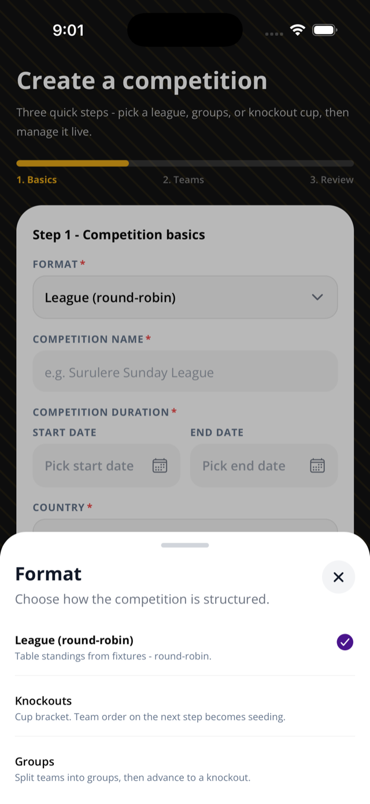

This page helps an organizer create a new competition from the mobile app.

## Before you start

- You must be signed in.
- You need at least two teams to schedule games.
- Decide whether this competition should start as round-robin or knockout.

## Steps

1. Open the **Create** tab.
2. Sign in if the app asks you to.
3. Enter the competition name.
4. Choose the country.
5. Add dates.
6. Choose the format: league/round-robin or knockout.
7. Add optional logo and settings.
8. Add at least two teams.
9. Review the setup.
10. Create the competition.

## Rules & good to know

- Creating a competition also creates the first season.
- For a normal league, Sportykore creates or ensures a round-robin stage and zeroed standings rows.
- For a knockout competition, the app can send knockout setup and seeding. With enough teams, Sportykore creates the knockout stage and bracket.
- Team logos and league logos are supported.
- Gender/division exists as a league setting.
- Dates must use valid dates. The end date must be on or after the start date.

## Related pages

- [Run seasons](/docs/seasons/)
- [Teams, rosters, and invites](/docs/teams-rosters-invites/)
- [Knockout brackets](/docs/knockout-brackets/)

