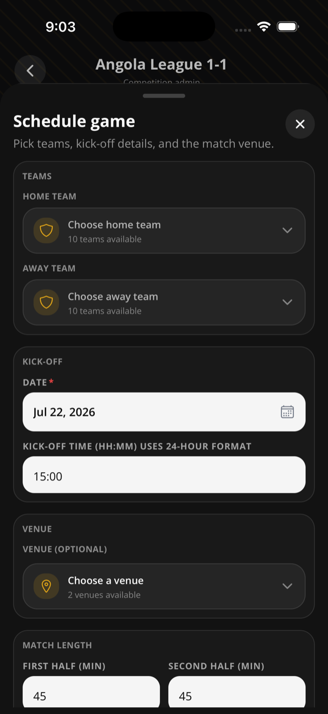
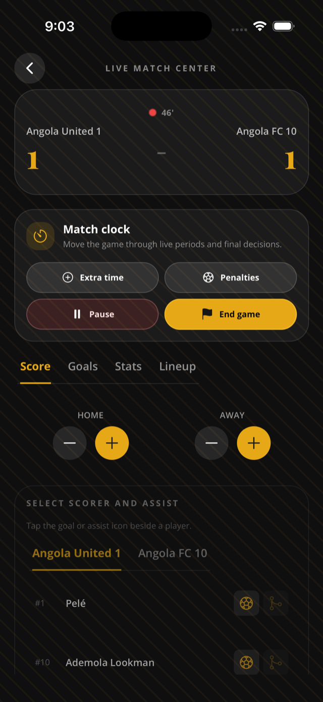
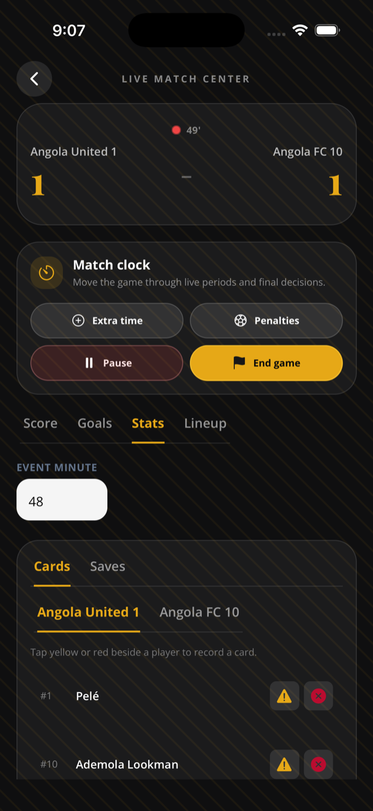
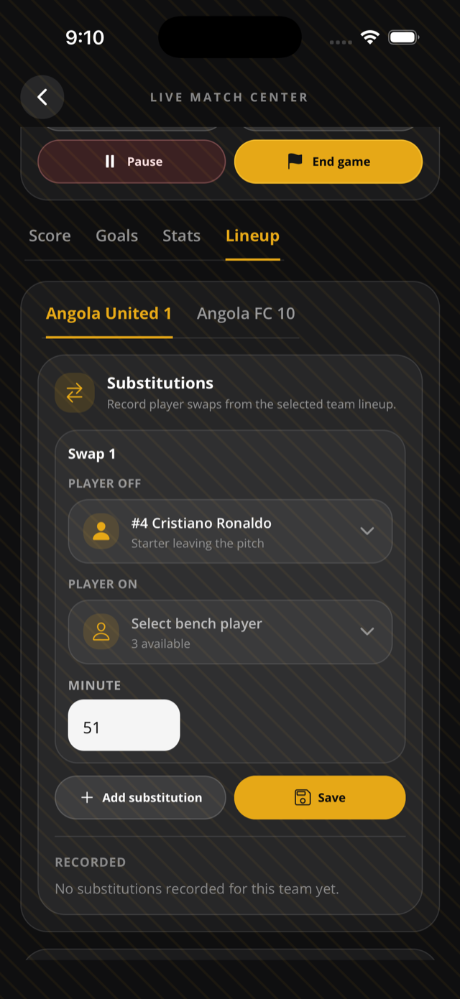

This page helps organizers run a game from fixture setup through full time.

## Before you start

- You must be the competition organizer, or a team admin with access to the match-day route for your assigned team.
- Add at least two teams first.
- Match-day writes require a connection.

## Schedule a fixture

1. Open **Manage > Games**.
2. Tap **Add game**.
3. Pick home and away teams.
4. Add kickoff date/time.
5. Set first and second half duration.
6. Choose a saved venue, create a venue inline, or type a one-off venue name.
7. Save.

## Start and control the match

1. Open the scheduled game in Live Match Center.
2. Tap **Start first half**.
3. Move to **Half time** when the first half ends.
4. Tap **Start second half**.
5. Choose full time, extra time, penalties, or pause when needed.
6. Confirm the full-time score or penalty scores.

## Score goals quickly

1. Open the **Score** tab.
2. Tap **+** for the scoring side.
3. Select the scorer from the active roster.
4. Optionally select the assist.
5. Adjust the minute.
6. Toggle own goal if needed.
7. Log the goal, or skip attribution.

## Fix a quick score change

1. Tap **-** for the side that needs one goal removed.
2. Sportykore removes the latest uncredited goal placeholder for that team.

## Record cards, saves, and substitutions

1. Open the **Stats** tab.
2. Enter the event minute.
3. Pick cards or saves.
4. Tap yellow card, red card, or save beside the player.
5. For substitutions, open the **Lineup** tab substitution panel.
6. Pick player off, player on, and minute.
7. Save the substitution.

## Finish with penalties

1. Choose penalties from the match controls when the game needs a shootout.
2. Enter unequal penalty scores.
3. Complete the game.

## Rules & good to know

- Home and away team must be different.
- The app defaults both halves to 45 minutes.
- Scheduled or postponed games can move to first half.
- First half moves to half time. Half time moves to second half.
- Second half can move to full time, extra time, penalties, or pause.
- Extra time can move to full time, penalties, or pause.
- Pause stores the previous active status. Resume shifts the period start time by pause duration.
- Full time can set the winner when score or penalty score is decisive.
- Knockout ties advance after full-time or shootout completion where applicable.
- A goal increment creates an uncredited goal stat row.
- Goal accreditation only works on uncredited goal placeholders.
- Assists are not allowed on own goals.
- Scorer and assist cannot be the same player.
- Players must be active on one of the game teams.
- Own goals are stored as the `own_goal` stat type.
- Cards can be recorded for active roster players.
- Saves are filtered to goalkeepers in the mobile UI.
- Substitutions require a submitted lineup.
- Substitutions create paired `substitution_off` and `substitution_on` stat rows.
- Substitution events do not change the displayed starting lineup. The app says the starting lineup on the pitch stays unchanged.
- Editing score from the game list is possible, and the app warns that deleting stats does not automatically adjust score.

## Related pages

- [Venues](/docs/venues/)
- [Lineups](/docs/lineups/)
- [Standings](/docs/standings/)
- [Knockout brackets](/docs/knockout-brackets/)

