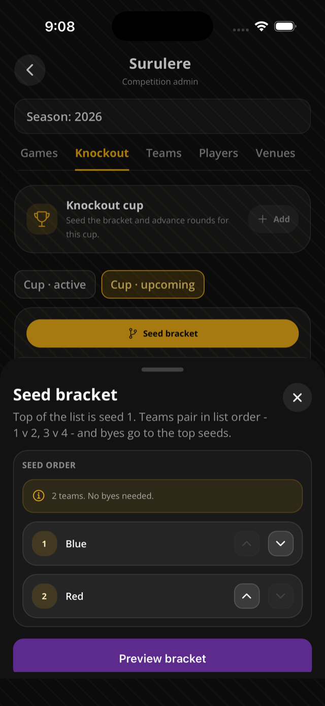
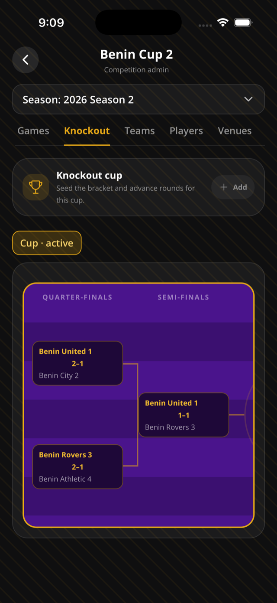

This page helps organizers run a knockout competition or knockout season.

## Before you start

- You must be the competition organizer.
- You need at least two unique teams.
- Confirm seeding carefully before play starts.

## Create a knockout

1. Create a knockout competition, or create a knockout-format season.
2. Choose the tie format: single match, home and away, best of 3, or custom best of N.
3. Optionally turn on a third-place playoff.
4. Add teams.
5. Put teams in seed order.
6. Create the bracket.

## Run ties

1. Open **Manage > Knockout**.
2. Open a tie game.
3. Run the match from Live Match Center.
4. Finish the game with a winner when the tie requires one.
5. When the current round is complete, generate the next round.
6. After final and third-place requirements are met, mark the stage complete.

## Rules & good to know

- Seeding is one-time. After ties exist, Sportykore rejects reseeding.
- Bracket size is the next power of two.
- Top seeds receive byes.
- Byes create completed ties with no games.
- Single-match ties require a winner.
- Two-legged ties aggregate goals relative to tie home/away.
- Two-legged ties can use an optional away-goals tiebreak.
- If two-legged aggregate remains tied, the second-leg winner decides, usually after penalties.
- Best-of ties create the first game first.
- Best-of ties dynamically create the next leg after each full-time game until a team reaches target wins or all games are played.
- Best-of home side alternates by leg.
- Next-round generation is an explicit organizer action.
- Generating the next round is idempotent if that round already exists.
- Third-place ties are generated from semi-final losers when configured.
- Public league pages show a **Bracket** tab when the season has a knockout stage.
- Knockout games do not affect round-robin standings.

## Related pages

- [Create your first competition](/docs/first-competition/)
- [Fixtures and live match day](/docs/fixtures-match-day/)
- [Standings](/docs/standings/)

