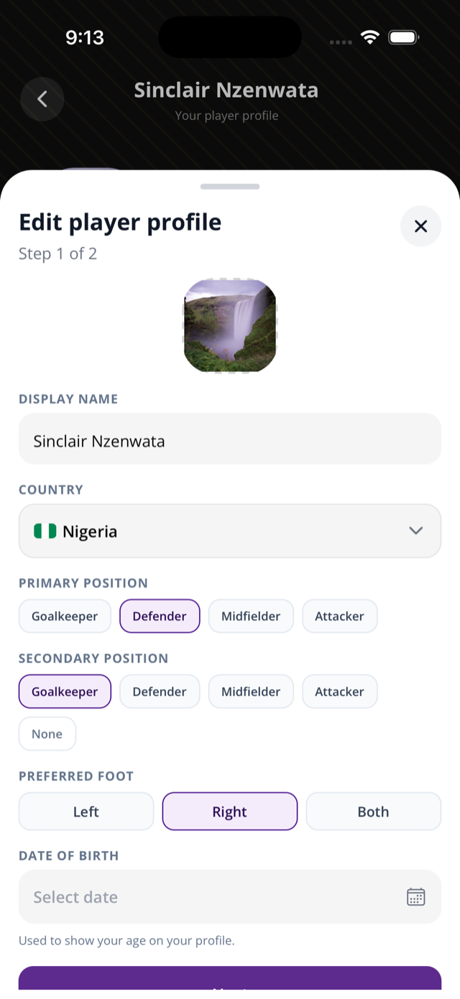

This page helps organizers and players understand player profiles and career totals.

## Before you start

- Players join through invite links or codes from an organizer.
- Player profile creation currently happens during invite acceptance.
- Stats come from match events recorded by organizers or team admins.

## Player creates a profile

1. Receive an invite link or code from the organizer.
2. Open the link, or paste the code in **Join League**.
3. Sign in or create an account.
4. Complete profile creation if the app asks.
5. Join the team roster.
6. Open your profile from **Profile**, squad pages, match events, search, or public pages.

## View player stats

1. Open a player profile.
2. Use **Overview**, **Matches**, and **Career** tabs.
3. Switch league or season when the player has more than one membership.

## Rules & good to know

- Player profiles include name, country, avatar URL field, bio field in schema, and roster/stat history.
- The mobile profile page currently renders initials rather than the remote avatar.
- Backend aggregates memberships, stats, and team games by league and season.
- Career totals are computed from stat rows.
- Career totals count goals, assists, and card stats from recorded events.
- Own goals are stored as a separate `own_goal` stat type. Do not treat them as normal player goals unless the app displays them that way.
- Player profile games are derived from player stats and team memberships.
- Seeded stat types include goals, own goal, assists, yellow card, red card, saves, shots on target, fouls conceded, substitution on, and substitution off.
- The mobile match center exposes goals, assists, own goals, yellow/red cards, saves, and substitutions.
- Shots on target and fouls conceded exist as stat types, but no direct mobile control was found in the current match center.

## Penalties

- An in-play penalty is recorded as a normal goal. There is no dedicated penalty goal stat type or UI.
- Shootout penalties are stored only as shootout scores on the game.
- Shootout penalties do not create goal stat rows and do not count toward player career goals.
- Sportykore does not record individual shootout takers or scored/missed attempts.

## Related pages

- [Teams, rosters, and invites](/docs/teams-rosters-invites/)
- [Fixtures and live match day](/docs/fixtures-match-day/)
- [Lineups](/docs/lineups/)
- [Limits and roadmap](/docs/limits-roadmap/)

