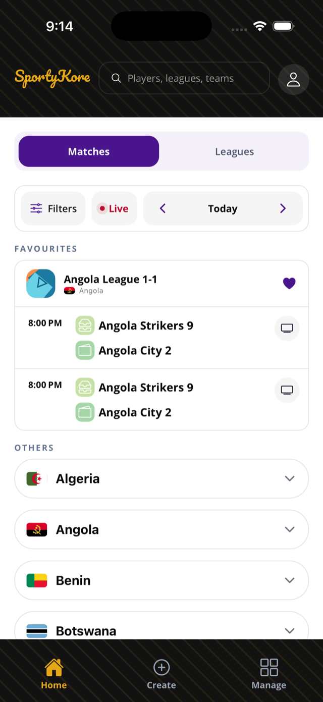
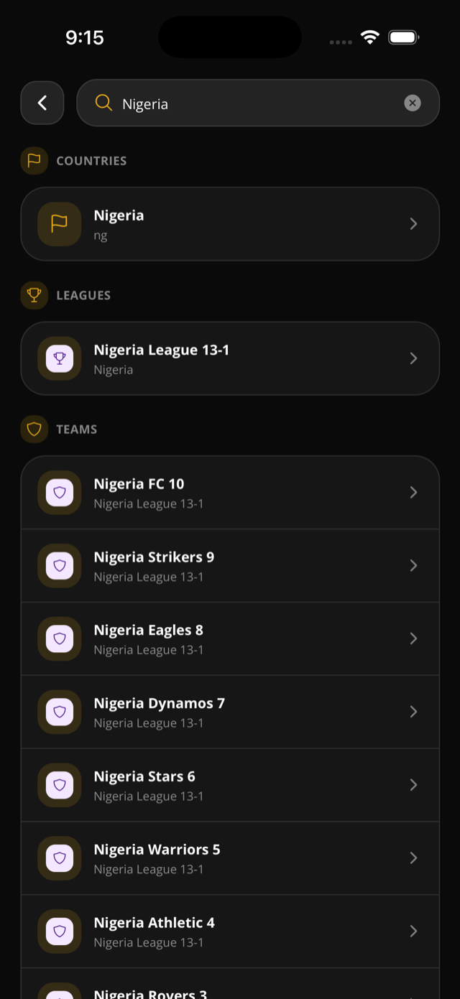

This page helps viewers find competitions and follow what is happening.

## Before you start

- You can browse public pages without signing in.
- You must sign in to favourite a league.

## Browse public pages

1. Complete onboarding.
2. Open the home feed.
3. Browse competitions by country or match day.
4. Open a league, match, team, player, or country page.

## Use search

1. Tap search on home.
2. Enter a query.
3. Open a grouped result for players, countries, leagues, or teams.

## Favourite a league

1. Tap the heart on a league card.
2. Sign in if the app asks you to.
3. Return to home.
4. Find the league in **Favourites**.

## What public pages show

- League pages can show overview, matches, standings, bracket, stats, and a season picker.
- Match pages can show overview, score, phase, kickoff, venue, address, map/directions, event timeline, lineups, and team stats/events.
- Team pages can show overview, squad, matches, and standings context.
- Player pages can show season stats, career totals, clubs, fixtures, and country when present.
- Country pages group public competitions and players by country.

## Rules & good to know

- Matches and standings tabs show when a season has a round-robin stage.
- Bracket tab shows when a season has knockout stages.
- Stats tab is always present on the public league page.
- Empty search returns an empty result list.
- Search limit defaults to 24 and maxes at 100.
- The mobile app stores recent searches locally.
- Favouriting and unfavouriting require sign-in.
- Public league feeds can decorate favourite state when you are logged in.

## Related pages

- [Getting started](/docs/getting-started/)
- [Standings](/docs/standings/)
- [Knockout brackets](/docs/knockout-brackets/)
- [Player profiles and stats](/docs/player-profiles-stats/)

