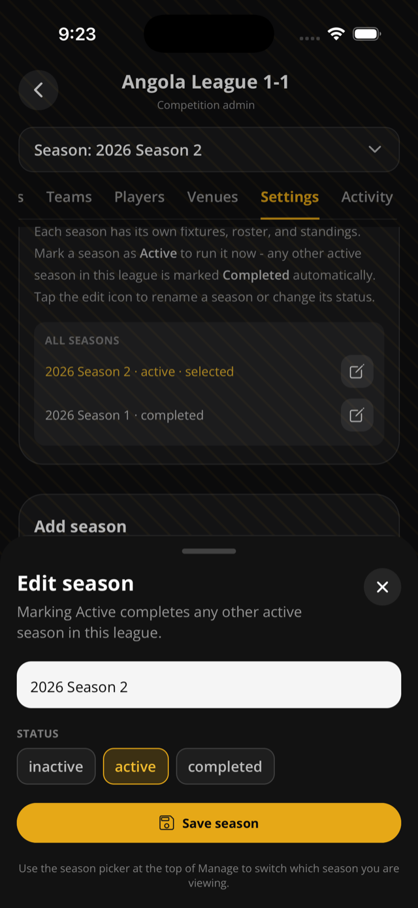

This page helps organizers run a competition over more than one season.

## Before you start

- You must be the competition organizer.
- Open the competition from **Manage**.

## Steps

1. Open **Manage**.
2. Select your competition.
3. Open **Settings**.
4. Enter the new season name.
5. Pick the season status: inactive, active, or completed.
6. Pick the format: league/round-robin or knockout.
7. Add the season.

## Switch seasons on public pages

1. Open the public league page.
2. Use the season picker.
3. Open Matches, Standings, Bracket, or Stats based on what the season has.

## Rules & good to know

- Each season has its own fixtures, roster, standings, and stages.
- Marking one season active automatically completes any other active season in the same league.
- Creating a league-format season ensures a round-robin stage.
- Creating a knockout-format season creates a knockout stage, but may require seeding before bracket play.
- League settings apply to the whole league, not just the selected season.
- Changing the tiebreaker re-sorts standings for the active season.

## Related pages

- [Create your first competition](/docs/first-competition/)
- [Standings](/docs/standings/)
- [Knockout brackets](/docs/knockout-brackets/)

