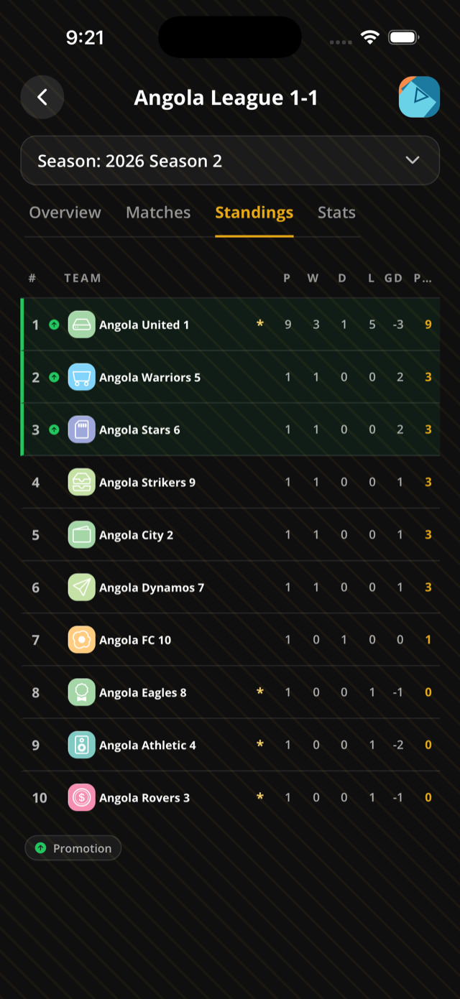

This page helps organizers and viewers understand competition tables.

## Before you start

- Standings are for round-robin stages.
- Knockout games do not affect standings.

## Steps

1. Create a league/round-robin competition or season.
2. Add teams.
3. Schedule round-robin games.
4. Run games to full time.
5. Open the public league page.
6. Open **Standings**.

## Change tiebreakers

1. Open **Manage > Settings**.
2. Pick a tiebreaker preset.
3. Save the league.
4. Open standings again to see the active season re-sorted.

## Manage table adjustments and zones

1. Open **Manage > Standings**.
2. Use standing tools to add approved point adjustments with a reason.
3. Resolve tied cohorts manually when your competition rules need a final decision.
4. Add promotion, playoff, qualification, or relegation zones to highlight table positions.

## Rules & good to know

- Sportykore caches standings rows instead of computing only at request time.
- Recalculation uses full-time games in the round-robin stage.
- Win = 3 points, draw = 1 point, loss = 0 points.
- Table fields include played, wins, draws, losses, goals for, goals against, goal difference, points, position, and form.
- Form is computed from the last five outcomes, such as `W,D,L`.
- Points always rank first.
- Supported tiebreaker criteria include goal difference, goals scored, wins, goals conceded, away goals scored, and head-to-head mini-league variants.
- Final fallback is team ID order.
- Point adjustments require a reason.
- Manual ordering is intended for tied teams.
- Standing zones are visual markers only. They do not change points or results.

## Related pages

- [Run seasons](/docs/seasons/)
- [Fixtures and live match day](/docs/fixtures-match-day/)
- [Knockout brackets](/docs/knockout-brackets/)
- [Limits and roadmap](/docs/limits-roadmap/)
